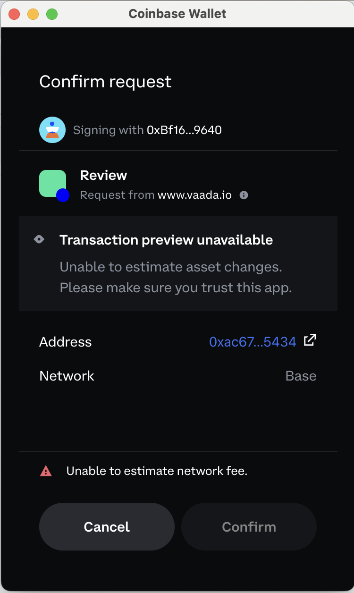
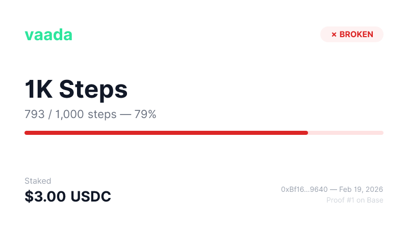

# Vaada: The Promise Market

**Version 3.0 — February 2026**

<p align="center">
  
</p>

*The commitment market where you bet on yourself.*

---

## Abstract

Vaada is a commitment market where users stake money on personal promises. Keep your promise, keep your stake. Break it, and your money goes to those who succeeded.

Think Polymarket, but for personal commitments instead of world events. "Bet on yourself."

*"Vaada" means "promise" in Hindi.*

**Status: Live on Base Mainnet** 🚀

---

## The Problem

**$72 billion** is spent annually on fitness and self-improvement. Yet:

- 92% of people fail their New Year's resolutions
- 50% of gym memberships go unused
- Fitness apps have <5% long-term retention

The missing ingredient isn't information or access — it's **commitment with real stakes**.

Behavioral economics shows loss aversion is 2x stronger than gain motivation. People work harder to avoid losing $100 than to gain $100. Existing accountability tools don't work because:

- Existing apps (Beeminder, StickK) are niche, ugly, and don't grow
- No social/competitive element — it's just you losing money to a company
- No crypto-native solution exists

**The core insight:** People don't fear losing money to an app. They fear losing money to *other people* — especially people trying to beat them.

---

## The Solution

**Vaada turns promises into markets.**

1. **Stake** — Put real money on your goal (e.g., "$5 on 10K steps today")
2. **Compete** — Others join the same challenge with their stakes
3. **Verify** — Automatic verification via Fitbit, Strava, etc.
4. **Settle** — Hit your goal = stake returned + bonus from losers. Miss = stake goes to winners.

No middleman. No refunds. No excuses.


*The Vaada homepage: browse active promises, stake USDC, and track your commitments — all from a single interface.*

**Why it works:**
- Real money at risk (not points or badges)
- Social pressure (you're competing against real people)
- Upside potential (you can *win* money, not just not-lose it)
- Trustless payouts (smart contract, not company discretion)
- Money works while locked (stakes earn yield via Morpho vault)

---

## Why Crypto — Five Properties That Make Vaada Impossible Without It

### 1. Programmable Consequences

You can't call Chase and say "hold my $50 and release it based on a Strava API call next Tuesday." They'd hang up. Smart contracts make this trivial.

Vaada's killer feature isn't money — it's **programmable rules around money**. The contract encodes exactly what happens when you succeed or fail. No human in the loop. No dispute process. No customer service. The code is the judge.

**Future applications:**
- Progressive consequences — miss day 1, stake drops 10%. Miss day 2, another 20%. Real-time pain, not just end-of-week binary.
- Consequence routing — "If I lose, my $50 goes to a cause I hate." Anti-charity motivation.
- Conditional unlocks — "I can't access my own $500 until I've run 50 miles." Self-imposed, code-enforced savings.

### 2. Instant Global Settlement

When you win a Vaada goal, your winnings + yield settle instantly to your wallet. Not 3-5 business days. Not an ACH transfer. You run 20 miles on Sunday, you have your money Sunday.

Someone in Lagos and someone in London can join the same goal. No currency conversion, no international transfer fees. USDC is USDC everywhere. This is a massive unlock for global expansion.

### 3. Ownership Without Intermediaries

Your money is held by code, not a company. No Vaada employee can touch user funds. No server to hack. No CEO who can run off with deposits. The contract is the custodian.

**Future applications:**
- Onchain goal receipts — non-transferable proof of completion. "Shane ran 20 miles, Feb 2026. Verified by Strava. Settled onchain." Your fitness diploma that nobody can fake or revoke.
- Portable reputation — your commitment history follows your wallet, not your account. "This wallet has completed 47 goals with a 92% win rate."

### 4. Composability

Stakes already sit in Morpho earning ~4.9% APY while goals are active. Idle money isn't idle. But this goes further.

Every crypto app can read and build on every other crypto app without permission. Vaada contracts are public infrastructure:
- Fitness apps that display your active Vaada stakes
- Health insurance apps that read your onchain commitment history and offer lower premiums
- DeFi protocols that accept locked Vaada stakes as collateral
- Other developers creating new goal types on top of the Vaada settlement layer

### 5. Skin in the Game as a Design Pattern

Vaada doesn't just use money — it uses money to **change who people become**. The stake isn't a payment. It's a psychological commitment device. You're not buying a service. You're buying accountability from yourself.

This is the most elegant solution for accountability: no trust required, no courts, no arbitration. Just math.

**Vaada is the only product that uses every unique property of crypto to solve a universal human problem.**

---

## The Innovation

**Programmable consequences for real-world behavior.**

Before now, you could:
- Bet on sports (someone else's behavior)
- Bet on prices (market behavior)
- "Commit" to personal goals (honor system, no enforcement)

With Vaada, you program automatic, trustless consequences for *your own* verified actions. The oracle fetches your data, the contract evaluates the outcome, the money moves. No disputes. No referees.

This pattern — verifiable real-world outcomes triggering on-chain settlement — unlocks consequences for any behavior with a data source:

| Domain | Data Source | Example |
|--------|-------------|---------|
| Fitness | Fitbit, Strava, Apple Health | Steps, miles, workouts |
| Learning | Coursera, Duolingo | Course completion |
| Productivity | GitHub, Linear | Shipping code |
| Health | Oura, Whoop | Sleep, recovery |
| Finance | Plaid | Savings goals |

Vaada is the first product built on this primitive. It won't be the last.

---

## Why Now

1. **Polymarket proved it** — Prediction markets hit mainstream in 2024. People understand "stake money on outcomes."
2. **Crypto UX is finally good** — Base (cheap, fast), Privy (email login), USDC (stable). No more MetaMask + ETH gas nightmares.
3. **Wearables are everywhere** — 30%+ of US adults have a fitness tracker. Verification is automatic.
4. **Self-improvement is massive** — $15B+ market in the US alone. Apps, coaches, programs — but no one's added real stakes.

---

## How It Works

### The User Experience


*A live goal card on mobile: see the promise, the stake, the deadline, and your progress at a glance.*


*Detailed goal view: real-time progress tracking, participant list, countdown timer, and settlement status.*

### Smart Contract Architecture

```
User Stakes USDC
       ↓
   VaadaV3.sol (holds funds, tracks goals)
       ↓
   USDC deposited to Morpho Vault (earns ~4.9% APY)
       ↓
   Deadline Reached
       ↓
   Backend Verifier (fetches Fitbit/Strava API)
       ↓
   verifyParticipant(goalId, participant, actualValue)
       ↓
   Morpho withdrawal + Settlement (winners paid, losers slashed)
       ↓
   VaadaReceipts.sol (soulbound proof minted — kept or broken)
       ↓
   Dynamic NFT metadata + proof card image (via /api/metadata/)
```

### Goal Types

| GoalType | Data Source | Metric |
|----------|-------------|--------|
| STRAVA_MILES | Strava API | Miles run/cycled |
| FITBIT_STEPS | Fitbit API | Daily step count |

### Economic Model

**For Users:**
- **Winners**: Receive stake back + proportional share of loser pool (based on stake size)
- **Losers**: Stake distributed to winners weighted by their stakes
- **Fee**: 0% — platform never touches user stakes

**Payout formula:**
```
Your Bonus = (Your Stake / Total Winner Stakes) × Loser Pool
```

---

## Business Model

### Revenue Streams

1. **Yield on deposits via Morpho** (current, primary)
   - All staked USDC auto-deposited into Morpho vault (Gauntlet USDC Prime)
   - Earns ~4-5% APY while funds are locked
   - Users get their stake back; Vaada keeps the yield
   - Zero friction — happens automatically in the smart contract

2. **Platform fee** (future)
   - 2-5% of each pool at settlement
   - Not currently active — yield covers early costs

3. **Premium features** (future)
   - AI Coach (personalized nudges, progress tracking, strategy)
   - Custom/private challenges
   - Corporate dashboards
   - White-label licensing

4. **B2B / Enterprise** (future)
   - Corporate wellness programs (companies fund employee goal pools)
   - Insurance partnerships (commitment score = lower premiums)
   - Gym/health app integrations (white-label accountability)

### Yield Scales with TVL

| TVL | Annual Yield (5%) |
|-----|-------------------|
| $10K | $500 |
| $100K | $5,000 |
| $1M | $50,000 |
| $10M | $500,000 |
| $100M | $5,000,000 |

### Unit Economics

| Metric | Assumption |
|--------|------------|
| Avg stake | $10 |
| Avg pool size | $50 (5 players) |
| Avg challenge duration | 7 days |
| Revenue per user/month | ~$3 |
| CAC target | <$10 |
| LTV target | >$30 |

---

## Market Opportunity

### The Promise Market

Commitment isn't a feature — it's a **market**.

Every coach, gym buddy, AA sponsor, and accountability partner proves demand exists. People pay for someone to hold them to their word. Vaada makes that programmable.

**Adjacent markets we pull from:**
- Fitness/wellness: **$96B**
- Prediction markets: **$65B**
- Habit/productivity apps: **$12B**
- Corporate wellness: **$56B**
- Personal coaching: **$15B**

---

## Competitive Landscape

No YC-backed startup (across 5,000+ companies) builds what Vaada builds. Zero on-chain competitors exist.

### Direct Competitors

| Competitor | Model | Weakness |
|------------|-------|----------|
| **StepBet/DietBet** (WayBetter) | Pool betting on steps/weight | Web2, centralized, dated UX |
| **Forfeit** | Habit contracts, forfeit to charity | Human referee verification (gameable), subscription model |
| **HealthyWage** | Weight loss cash prizes | Weight-only, video weigh-ins |
| **StickK** | Commitment contracts, $ to charity | Ancient UX, self-report, never scaled |
| **Beeminder** | Pledge $ if off track | Quantified-self nerds only, money goes to Beeminder |

### Crypto Adjacent

| Competitor | Model | Weakness |
|------------|-------|----------|
| **Receipts.xyz** | Points for workouts | Rewards not stakes — no loss aversion |
| **STEPN/Sweatcoin** | Move-to-earn | GameFi ponzinomics, not commitment |

### Feature Competitors

| Platform | Note |
|----------|------|
| **Strava Challenges** | 120M users, but free = no behavior change |
| **Nike/Apple/Fitbit** | Massive distribution, no financial stakes |

### Why Nobody Has Won

1. **Web2 can't do trustless settlement** — StepBet decides who wins. Vaada's smart contracts decide automatically.
2. **Human verification is gameable** — Forfeit uses referees/photos. Vaada uses Fitbit/Strava APIs.
3. **Move-to-earn was backwards** — Printing tokens to reward activity is unsustainable. Vaada uses real money and loss aversion.
4. **No one combined all the pieces** — On-chain stakes + API verification + yield + consumer UX.
5. **Agentic future** — Voice-enabled AI agents will stake on behalf of users. On-chain contracts are agent-compatible; Web2 dashboards behind logins are not.

### Vaada's Moat

- First and only crypto-native commitment market
- Trustless settlement via smart contracts
- Automated API verification (not human referees)
- Yield on locked stakes via Morpho (~4.9% APY)
- Built on Base — Coinbase's 110M user ecosystem, penny gas, Apple Pay onramp
- Composable — other apps can integrate Vaada as accountability infrastructure
- Expandable — works for any verifiable commitment, not just fitness


*The leaderboard: see who's winning, who's falling behind, and where you stack up against the competition.*

---

## Go-to-Market

### Phase 1: Friends & Fitness (Now)
- Seed with personal network — individual texts, $10 stake challenges
- The win moment IS the marketing: "I won $73 by keeping my promise"
- Iterate on UX based on real feedback

### Phase 2: Crypto Twitter & Farcaster (Month 2-3)
- "I staked $50 on 10K steps" threads with shareable screenshots
- Farcaster community activation — builders + fitness overlap
- Base ecosystem partnerships and grants

### Phase 3: Fitness Communities (Month 4-6)
- Reddit (r/fitness, r/running), Strava clubs, Fitbit groups
- Running event partnerships
- Fitness influencer collabs — "The app that pays you to work out"

### Phase 4: Mainstream Consumer (Month 6-12)
- TikTok/Instagram fitness creators
- Mobile app (iOS)
- Credit card onramp — user never sees USDC
- "The app that pays you to work out" narrative

### Phase 5: B2B & Partnerships (Year 2)
- Corporate wellness programs
- Insurance partnerships (commitment score = lower premiums)
- White-label for gyms, health apps
- Employer-funded goal pools

---

## Product Roadmap

### ✅ Shipped (Q1 2026)
- Core contracts deployed (Base mainnet)
- Fitbit (steps) + Strava (miles) integration
- Privy wallet integration (email/Google login, embedded wallets)
- NewUserChallenge onboarding contract (V4 — no Chainlink, onchain self-settlement)
- Morpho vault yield integration (~4.9% APY)
- Onchain goal receipts (VaadaReceipts — soulbound, non-transferable proof of commitment)
- Dynamic NFT proof cards (ERC-721 metadata + generated images via next/og)
- "View Proof" links to OpenSea from receipt history
- Profile dropdown viewport fix for mobile
- Win moment celebration (confetti, share-to-X, native share, manual dismiss)
- Invite-a-friend button on goal cards (native share / clipboard)
- Prominent countdown timer on active goal cards
- Progress bar with real-time tracking for joined participants
- Add-to-Calendar (.ics download with 2hr reminder)
- Context-aware empty states in Browse Promises
- Gas sponsorship (gasless for embedded wallets)
- Coinbase Onramp (Apple Pay, debit card)
- Profile names & leaderboards
- Automated cron verification + settlement
- Anti-cheat (manual activity filter)


*The win moment: confetti, earnings summary, and one-tap sharing — the reward loop that drives virality.*


*Onchain proof of commitment: a soulbound NFT receipt showing your promise, your progress, and your result — permanently on Base.*

---

### Phase 2: First 100 Users (Q1 2026)

| Feature | Description | Impact |
|---------|-------------|--------|
| **AI Coach v1** | Daily progress nudges via Telegram/SMS. "You're 4 miles short, 3 days left." Uses existing Strava/Fitbit data. | Retention — keeps users engaged mid-goal |
| **Anti-charity routing** | "If I lose, my $50 goes to a cause I hate." User picks consequence destination. | Viral — most shareable mechanic possible |
| **Referral mechanic v2** | Deep referral tracking + pool bonus for both. Invite button already shipped. | Growth — organic invite loop |

---

### Phase 3: 100 → 1,000 Users (Q2 2026)

| Feature | Description | Impact |
|---------|-------------|--------|
| **Social feed** | See friends' active goals, completions, and streaks. | Retention + growth — FOMO + accountability |
| **Suggested stake amount** | "Based on your history, we recommend $75." ML-optimized for completion. | Retention — higher stakes = higher engagement |
| **More Fitbit goal types** | Active minutes, distance, calories. | Growth — broader appeal, same integration |
| **Apple Health integration** | iPhone users don't need Fitbit or Strava. | Growth — massive unlock, 1B+ iOS devices |

---

### Phase 4: 1K → 10K Users (Q2-Q3 2026)

| Feature | Description | Impact |
|---------|-------------|--------|
| **Streak system** | Goals 1→2→3 with escalating stakes. Compounding commitment. | Retention — longest-term engagement loop |
| **Group goals** | 5 friends stake together. Social pressure + bigger pools. | Growth — viral invites, bigger pools |
| **Progressive consequences** | Miss day 1 = 10% penalty. Miss day 2 = 20%. Real-time. | Retention — daily engagement, not just weekly |
| **Dashboard v2** | Goal history, win rate, total earned, commitment score. | Retention — your onchain identity |
| **Education goals** | Duolingo streak, Coursera completion. First non-fitness vertical. | Growth — new market, same mechanic |

---

### Phase 5: 10K → 100K Users (Q3-Q4 2026)

| Feature | Description | Impact |
|---------|-------------|--------|
| **Vaada Protocol** | Open contract interface. Other devs build goal types and frontends. | Growth — become the settlement layer |
| **Credit card onramp** | Stripe/MoonPay. Pay $50 with Visa, never see USDC. | Growth — removes last crypto friction |
| **Self-lock vaults** | "Lock my $500 until I run 50 miles." Savings + fitness. | Retention — new use case, same contracts |
| **Employer integrations** | Companies fund employee goal pools. B2B revenue. | Revenue — enterprise product line |
| **Mobile app (iOS)** | Native push notifications, AI coach, daily engagement. | Retention + growth — real mobile experience |


*Browse Promises: discover active goals across fitness categories, see stakes and deadlines, and join with one tap.*


*Filter by goal type, stake range, and timeline to find the perfect challenge.*


*See community activity: who's joining, who's winning, and which promises are trending.*

---

### Phase 6: 100K+ Users (2027)

| Feature | Description | Impact |
|---------|-------------|--------|
| **Portable reputation** | Wallet-based commitment score. Read by other apps: insurance, dating, hiring. | Moat — onchain identity that compounds |
| **Multi-chain** | Solana, Arbitrum, Ethereum. Go where the users are. | Growth — new ecosystems |
| **Prediction market hybrid** | "Will Shane run 30 miles?" Friends bet on your goals. | Growth — Polymarket meets Vaada |
| **Vaada for Business** | Enterprise dashboard. Corporate wellness. Treasury yield. | Revenue — B2B product line |
| **Insurance partnerships** | Lower premiums for high commitment scores. | Revenue — real-world value from onchain data |
| **Agentic AI** | Voice-enabled staking. "Hey Siri, stake $50 I'll run 20 miles this week." | Growth — frictionless entry, future-proof |

---

### Build Priority Framework

At every phase, every feature must answer at least one:

1. **Does this get more users?** (Growth)
2. **Does this keep users coming back?** (Retention)
3. **Does this make users share?** (Virality)

If a feature doesn't serve one of these three, it waits.

---

## Scaling Vision

| Stage | Valuation | What Vaada Is |
|-------|-----------|---------------|
| Seed | $5-10M | Best commitment app |
| Series A | $50-100M | Commitment market category owner |
| Growth | $500M-1B | Commitment infrastructure / protocol |
| Scale | $1B-10B | Global accountability layer |

Each stage is an **abstraction shift**: App → Category → Protocol → Primitive.

The headcount stays lean because each level, the protocol does more and humans do less. Smart contracts are employees that work 24/7 and never ask for equity.

| Users | Team Size | Focus |
|-------|-----------|-------|
| 0-1K | 1 (founder) | Product, users, iteration |
| 1K-10K | 2-3 | Engineering, growth |
| 10K-100K | 5-8 | Mobile, integrations, community |
| 100K-1M | 15-25 | Protocol, enterprise, international |
| 1M+ | 25-40 | Platform, partnerships, compliance |

---

## Traction

| Metric | Current | Target (3mo) | Target (12mo) |
|--------|---------|--------------|---------------|
| Users | Early beta | 100 | 1,000 |
| Total staked | — | $5,000 | $100,000 |
| Pools settled | — | 50 | 500 |

---

## Financials

### Current
- Self-funded, minimal expenses (~$50/mo infra)

### Projections

| Year | Users | GMV | Revenue | Expenses | Net |
|------|-------|-----|---------|----------|-----|
| 2026 | 1,000 | $100K | $4K | $10K | -$6K |
| 2027 | 10,000 | $1M | $40K | $50K | -$10K |
| 2028 | 50,000 | $10M | $400K | $200K | $200K |
| 2029 | 200,000 | $50M | $2.5M | $1M | $1.5M |
| 2030 | 1,000,000 | $500M | $25M | $5M | $20M |

### Funding

**Option A: Bootstrap** — Day job + Vaada until profitable. Slower but keeps equity.

**Option B: Raise seed ($500K-$1M)** — Go full-time, hire 1-2 people, accelerate to PMF. Target: crypto-native VCs, angels from Coinbase/Polymarket ecosystem.

### Exit Scenarios

| Scenario | Valuation | Acquirer | Thesis |
|----------|-----------|----------|--------|
| Acqui-hire | $5-10M | Coinbase, Strava | Talent + product |
| Category acquisition | $50-100M | Coinbase, health company | Own commitment market vertical |
| Growth acquisition | $500M-1B | Major tech/fitness | Strategic platform play |
| Independent | $1B+ | IPO / protocol token | Stand-alone category leader |

---

## Risks & Mitigations

| Risk | Mitigation |
|------|------------|
| Regulatory (gambling classification) | Skill-based outcomes — user controls result through effort. Legal review before scaling. Comparable to DraftKings/StepBet. |
| Cheating / data manipulation | Anti-cheat filters (manual activities blocked), multi-source verification, anomaly detection planned |
| Low retention after first goal | AI Coach, streak system, social features, escalating stakes |
| Smart contract bugs | Capped pools, incremental scaling, audit before major TVL |
| Competitor enters (Strava, Fitbit, Nike) | First-mover advantage, onchain composability moat, protocol network effects |
| Crypto market downturn | USDC-denominated (stable), not token-dependent, real utility not speculation |

---

## Technical Details

### Contracts (Base Mainnet)

| Contract | Address |
|----------|---------|
| VaadaV3 | `0xAc67E863221B703CEE9B440a7beFe71EA8725434` |
| GoalStakeAutomationV3 | `0xA6BcEcA41fCF743324a864F47dd03F0D3806341D` |
| NewUserChallenge V4 | `0xB77e1FFa0be50E0B867c8f9CcdDBd1a88D354824` |
| VaadaReceipts | `0x2743327fa1EeDF92793608d659b7eEC428252dA2` |
| Morpho Vault | `0xeE8F4eC5672F09119b96Ab6fB59C27E1b7e44b61` |
| USDC | `0x833589fCD6eDb6E08f4c7C32D4f71b54bdA02913` |

### Stack

- **Chain**: Base (Coinbase L2) — Mainnet
- **Yield**: Morpho Vault (Gauntlet USDC Prime, ~4.9% APY)
- **Frontend**: Next.js 16, Privy (embedded wallets), wagmi
- **Verification**: Backend verifier → Fitbit/Strava APIs
- **Auth**: Privy (email/Google login, embedded wallets, gas sponsorship)
- **Onramp**: Coinbase (Apple Pay, Google Pay, debit card)
- **Token Storage**: Supabase (encrypted refresh tokens)
- **Settlement**: Backend verifier (Fitbit/Strava APIs) + onchain self-settlement (NUC V4)

### NFT Proof System

- **VaadaReceipts** mints a soulbound (non-transferable) ERC-721 token on every settlement
- **Dynamic metadata** served via `/api/metadata/[tokenId]` — ERC-721 compliant JSON with name, description, attributes (status, promise, goal type, target, actual, stake, payout, date)
- **Proof card image** generated via `/api/metadata/image/[tokenId]` using `next/og` (Satori) with Inter font — shows promise name, progress bar, stake amount, wallet, and kept/broken status
- **OpenSea compatible** — `tokenURI` points to metadata API via `setBaseURI`
- Each receipt stores onchain: goalId, participant, goalType, target, actual, stakeAmount, payout, succeeded, startTime, endTime, mintedAt, goalName
- Viewable from profile dropdown via "View Proof" links to OpenSea

### Security

- Stakes held in audited ERC20 (USDC)
- Yield via Morpho vault (audited)
- Anti-cheat: only device-recorded activities count (`manual: false` filter)
- Gas sponsorship: Privy-managed, ~$0.001/tx on Base
- Contracts are unaudited MVP — audit planned before major scale

---

## Team

**Shane Sarin** — Solo Founder
- UNC Chapel Hill, Economics
- Product @ Consensys (2023-2025) — Growth across product suite including MetaMask
- Founding Business Analyst @ RECUR (2021-2022) — $50M-funded NFT platform, zero to launch
- Analyst @ Infosys (2020-2021)

Building solo with AI tooling. Smart contracts + AI = one person ships what used to take ten.

---

## Vision

**Short-term:** The best way to actually hit your fitness goals.

**Medium-term:** The protocol for all personal commitments — fitness, habits, learning, finances, career.

**Long-term:** The infrastructure layer for accountability. Every app that wants "stake money on X" uses Vaada under the hood.

**The primitive:** Helping people keep their promises is as fundamental a human problem as it gets. Every human makes promises to themselves. Every human struggles to keep them. Every human would put money on it if the experience was frictionless enough.

Polymarket let people bet on the world. Vaada lets people bet on themselves.

---

## Links

- **Website**: https://vaada.io
- **GitHub**: https://github.com/2shanez/vaada
- **BaseScan**: https://basescan.org/address/0xAc67E863221B703CEE9B440a7beFe71EA8725434
- **Contact**: hello@vaada.io

---

*"Keep Your Promise."*
